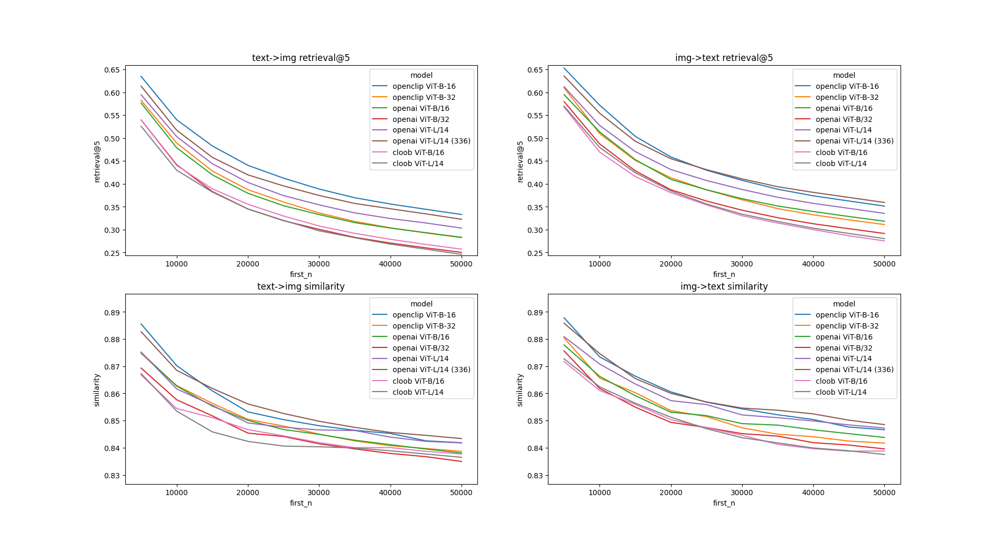

# clip_benchmark
clip retrieval benchmark

# Installation
```bash
pip install git+https://github.com/cat-state/clip_benchmark
```

# Usage
For normalized embeddings extracted with [clip-retrieval](https://github.com/rom1504/clip-retrieval),
```bash
python -m clip_benchmark benchmark --img-embeds-file coco-openclip/img_emb/img_emb_0.npy --text-embeds-file coco-openclip/text_emb/text_emb_0.npy --sentence-embs sent.npy --n 50000 --dataset "mscoco/{00000..00059}.tar"
```

Sentence embeddings will be created and saved if not already present at that path.

To make the plots below run `python -m clip_benchmark plots`

## API

To use it as a library:

```python3
from clip_benchmark import cross_modal_retrieval

results = cross_modal_retrieval(img_embeds, text_embeds, k=5)

print(results) # { "text->img": <boolean array with True where that item matched the query>,
							 #   "img->text": same as as above but for texts
							 #   "text->img-idxs": the retrieved indicies into the img_embeds
							 #   "img->text-idxs": same as above but for text_embeds }
```


